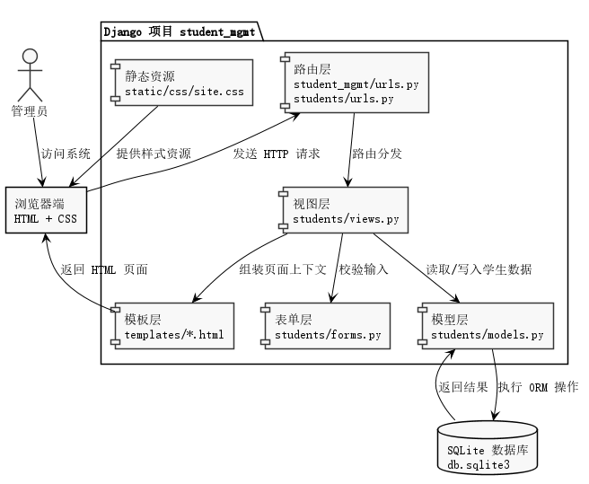
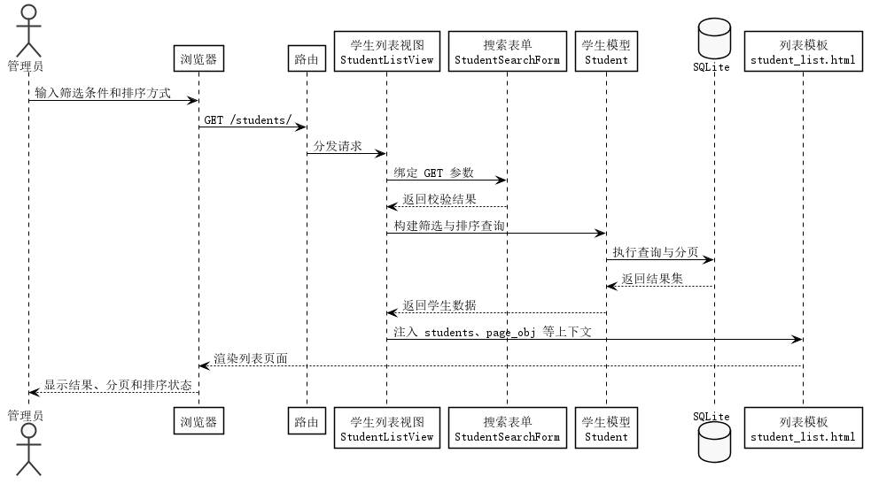
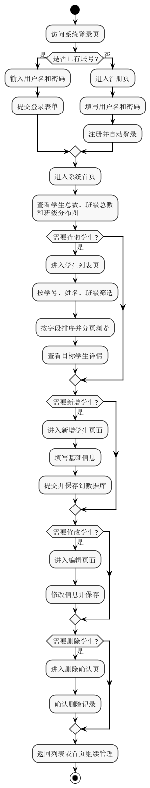

# 基于 Django 的学生管理系统详细说明文档

## 一、项目概述

本项目是一个基于 Django 框架开发的网页端学生管理系统，主要用于完成学生档案信息的集中录入、查询、维护和展示。系统围绕“学生档案”这一核心数据对象展开，通过管理员登录后进入统一后台，对学生的学号、姓名、性别、年龄、班级、电话、邮箱、地址和入学日期等信息进行标准化管理。整个项目采用 Django 自带的模板渲染机制完成前后端协同，不依赖前后端分离架构，因此部署简单、学习成本低、适合作为课程设计、实训项目、教学案例和中小规模管理系统的原型基础。

从功能目标上看，本系统解决的是传统纸质学生档案或零散表格难以维护的问题。管理员可以通过统一界面快速完成学生信息新增、编辑、删除、查看详情、条件筛选、分页浏览和排序控制，同时在首页查看学生总数、班级总数、最近录入记录以及班级分布可视化统计，从而形成一个结构清晰、操作直接、反馈明确的管理后台。

从技术实现方式上看，系统后端使用 Django 6 构建，数据存储采用 SQLite，页面层使用 Django Template 结合自定义 CSS 实现。当前项目定位为桌面网页端应用，不额外针对移动端交互进行复杂适配，因此界面布局、表格密度和信息组织都优先服务于电脑浏览器中的使用体验。

## 二、项目建设目标

本项目的建设目标可以概括为以下几个方面。首先，建立一个能够稳定运行的学生信息管理平台，使管理员可以对学生基础档案进行完整的增删改查操作。其次，通过认证机制保证只有登录用户才能访问系统核心页面，避免未授权访问。再次，通过搜索、排序和分页等功能提升数据管理效率，让系统在记录数量增加后仍然具备良好的可用性。最后，通过视觉优化和统计看板提升系统的信息展示能力，使系统不仅能够“录入数据”，还能够“读懂数据”和“呈现数据”。

## 三、系统适用场景

本系统适用于教学管理演示、小型班级档案管理、课程设计答辩展示、实验课作业提交、基础 Web 开发训练和 Django 入门实践等场景。由于系统结构清晰、依赖较少、数据模型单一，因此非常适合在学习阶段用来理解 Django 的典型开发流程，包括模型定义、表单校验、类视图开发、模板渲染、URL 路由组织和测试编写等关键知识点。

## 四、系统总体架构说明

项目整体采用经典的 Django MVT 架构思想，虽然 Django 官方称之为 Model、Template、View，但在实际理解时可以对应为数据层、业务处理层和页面展示层。系统的运行过程是：浏览器向服务端发起请求，请求首先进入路由层，路由层根据路径匹配对应的视图类；视图类再根据业务需要调用表单层进行输入校验，调用模型层进行数据库访问，然后把结果打包成上下文交给模板层渲染，最终返回 HTML 页面给浏览器。

上图展示了系统中最核心的几类模块关系。浏览器端承载页面访问和交互提交；路由层负责将不同请求导向不同功能入口；视图层负责组织业务逻辑；表单层承担输入验证和字段映射；模型层完成 ORM 数据操作；模板层和静态资源层负责最终页面输出。该结构的优点在于职责边界清晰，后续如果要扩展教师管理、成绩管理、课程管理等模块，也可以继续沿用相同模式进行扩展。

## 五、项目目录结构说明

本项目的目录组织具有典型的 Django 小型项目特征。`student_mgmt` 目录是项目配置核心，包含全局配置、主路由以及 WSGI/ASGI 入口；`students` 应用目录负责学生管理业务；`templates` 目录存放所有 HTML 模板；`static` 目录存放静态样式资源；`images` 目录用于保存本次文档配套的 PlantUML 图片；`docs` 目录用于保存项目说明文档。

更具体地说，`student_mgmt/settings.py` 定义数据库、模板目录、静态资源目录、认证跳转地址等全局参数；`student_mgmt/urls.py` 负责汇总系统主路由；`students/models.py` 定义学生数据模型；`students/forms.py` 定义新增编辑表单和搜索表单；`students/views.py` 定义登录后首页、学生列表、详情、新增、编辑和删除等主要页面逻辑；`students/tests.py` 则用于保证项目关键功能在修改后仍然可正常运行。

## 六、核心功能模块说明

### 1. 用户认证模块

系统支持管理员注册、登录和退出功能。认证逻辑使用 Django 内置用户系统完成，不需要自行设计用户表结构。对于未登录用户，系统通过 `LoginRequiredMixin` 限制访问首页、学生列表、学生详情以及增删改页面。注册功能由 `SignUpView` 提供，底层直接使用 `UserCreationForm` 完成用户名和密码创建。登录功能则通过 `django.contrib.auth.urls` 自动提供，减少了重复开发工作。

注册成功后，系统会自动调用 `login(self.request, self.object)` 完成登录，并通过消息框提示“注册成功，已自动登录”。如果用户已经登录，又尝试访问注册页面，则会被重定向回首页，避免重复注册或无意义访问。

### 2. 学生档案管理模块

学生档案管理模块是整个系统的业务核心。系统围绕 `Student` 模型进行所有数据操作。每条学生记录包含学号、姓名、性别、年龄、班级、电话、邮箱、地址、入学日期、创建时间和更新时间。其中学号被设计为唯一字段，用于防止重复录入；年龄使用最小值和最大值验证器保证输入合理；电话字段通过正则校验控制格式；邮箱字段使用 Django 内置邮箱类型自动校验。

新增学生时，管理员进入新增页面填写完整信息并提交。系统通过 `StudentForm` 进行字段映射和校验，通过 `StudentCreateView` 完成保存。编辑学生时，系统会把已有信息回填到表单，管理员修改后提交即可完成更新。删除学生时，系统会先进入确认页面，再通过 `DeleteView` 执行删除操作，避免误删。

### 3. 学生列表检索模块

学生列表页面是管理员日常使用频率最高的页面之一。系统在该页面中实现了筛选、排序、分页和操作跳转等功能。搜索部分使用 `StudentSearchForm` 实现，支持按学号、姓名和班级进行条件过滤。视图在 `get_queryset()` 中读取 GET 参数，若表单校验通过，则按非空条件组合过滤查询集。

在排序方面，系统预设了多个合法排序选项，包括按学号、姓名、班级、年龄、入学日期和创建时间进行升序或降序控制。排序值通过 GET 参数 `sort` 传递，并在视图中通过白名单字典进行映射，避免非法字段直接进入 `order_by()`，提高代码安全性和稳定性。

在分页方面，系统设置每页显示 10 条记录。当记录数超过 10 条时，页面底部会自动出现分页导航，支持首页、上一页、下一页和末页跳转，同时保留已有的筛选和排序参数，保证用户翻页时检索条件不会丢失。

### 4. 首页统计与可视化模块

首页用于展示系统概况。系统会统计当前学生总人数、班级总数，并抓取最近录入的 5 条学生记录。同时，系统还会按照班级名称对学生进行分组聚合，计算每个班级的人数、占总体学生数的百分比，以及相对于人数最多班级的条形宽度。这样既可以在列表区中展示结构化统计，也可以在图表区中生成直观的班级分布图。

虽然上图展示的是列表查询过程，但它能够帮助理解首页统计与列表查询的共同实现机制：前端发起请求，视图组织查询，模型访问数据库，模板完成结果渲染。首页统计本质上也是同样的请求处理链，只是查询方式从“单表列表过滤”变成了“聚合统计与上下文组装”。

## 七、数据库设计说明

本项目当前只包含一个核心业务表，对应 Django 中的 `Student` 模型。该模型的字段设计尽量保持简单而完整。学号 `student_id` 用于唯一标识一个学生，是最重要的主业务键；姓名 `name` 表示学生真实姓名；性别 `gender` 使用枚举形式限定为“男”或“女”；年龄 `age` 用于记录年龄并限制取值范围；班级 `class_name` 记录所属班级；电话 `phone`、邮箱 `email` 和地址 `address` 用于补充联系方式；入学日期 `enrollment_date` 记录入学时间；创建时间 `created_at` 和更新时间 `updated_at` 用于后台维护和排序分析。

从数据库规范角度看，该模型已经具备一个基础管理系统所需的核心字段和约束，但尚未做更复杂的实体拆分。例如，班级目前使用字符串存储，而不是单独建立 `Class` 表并通过外键关联。这样设计的优点是实现成本低、使用简单；缺点是班级名缺乏更高层级的统一管理能力。因此，如果未来需要扩展班主任、专业、学院、课程等信息，可以把班级从普通文本字段升级为独立模型。

## 八、URL 路由设计说明

系统路由分为两层。主路由位于 `student_mgmt/urls.py`，主要承担统一入口作用。其中 `/admin/` 对应 Django 后台管理系统，`/accounts/` 引入 Django 内置登录注销路由，根路径则交给 `students.urls` 继续分发。

在学生模块内部，`students/urls.py` 进一步定义了具体业务入口。`/signup/` 对应注册页，`/` 对应首页，`/students/` 对应学生列表页，`/students/create/` 对应新增页，`/students/<pk>/` 对应详情页，`/students/<pk>/edit/` 对应编辑页，`/students/<pk>/delete/` 对应删除确认页。这种组织方式清晰直观，便于维护，也符合多数 Django 项目按应用拆分 URL 的习惯。

## 九、表单设计与数据校验说明

系统包含两类主要表单。第一类是 `StudentForm`，用于新增和编辑学生。它基于 `ModelForm` 构建，因此模型字段和表单字段天然一致，能够减少重复定义。该表单对入学日期使用 `DateInput(type='date')`，让浏览器以日期控件方式呈现，提高录入效率。地址字段使用多行文本框，适合较长内容输入。

第二类是 `StudentSearchForm`，用于列表页条件筛选。它是普通 `Form`，包含学号、姓名和班级三个非必填字段。由于这些字段都允许为空，因此管理员可以只输入一个条件，也可以组合多个条件一起查询。视图会先验证表单，再从 `cleaned_data` 中读取结果构建查询条件，从而避免直接拼接原始请求参数带来的不稳定性。

## 十、视图逻辑设计说明

系统的主要业务逻辑集中在 `students/views.py` 中。该文件使用 Django 类视图构建功能页面，减少了重复代码。`DashboardView` 负责首页统计和图表数据准备；`StudentListView` 负责学生列表的查询、排序和分页；`StudentDetailView` 负责单个学生详情展示；`StudentCreateView` 和 `StudentUpdateView` 分别负责新增和编辑；`StudentDeleteView` 负责删除确认与删除执行；`SignUpView` 则负责管理员注册。

这些视图的共同特点是尽可能利用 Django 提供的通用类视图能力。例如列表页直接使用 `ListView`，详情页直接使用 `DetailView`，新增和编辑使用 `CreateView`、`UpdateView`，删除使用 `DeleteView`。这样做不仅可以减少样板代码，还可以使项目结构更加规范。开发者只需要在关键位置覆写 `get_context_data()`、`get_queryset()`、`form_valid()` 和 `form_invalid()` 等方法，即可在保留 Django 规范性的同时实现项目自定义需求。

## 十一、模板页面设计说明

系统的页面模板分为公共模板和业务模板两部分。`templates/base.html` 是所有页面的基础骨架，负责统一引入样式文件、导航栏、消息提示区域和主内容容器。登录页、注册页、首页、学生列表页、学生详情页、学生表单页和删除确认页都继承自该基础模板，因此页面风格保持一致。

在业务页面中，首页 `dashboard.html` 重点强调统计卡片、最近录入表格和班级分布图；列表页 `student_list.html` 重点强调筛选、排序、结果展示和分页导航；表单页 `student_form.html` 重点强调信息录入和校验反馈；详情页 `student_detail.html` 重点强调学生档案的完整查看；删除页 `student_confirm_delete.html` 重点强调风险提示和二次确认；认证页面则聚焦于快速登录和注册。

## 十二、前端界面优化说明

本项目在保留 Django 模板开发模式的基础上，对界面进行了中等强度优化，目标不是做成花哨展示页，而是让后台系统更有秩序、更有质感、更适合长时间使用。新的样式文件集中在 `static/css/site.css` 中，采用统一的色彩变量、圆角体系、卡片边界、按钮样式、标签样式和表格风格，使整个系统的观感更加一致。

系统首页加入了概览区和班级可视化图表，让管理员进入系统后能够快速理解当前数据状态；列表页增加了排序和分页状态显示，减少操作不确定性；表格中的班级和性别使用标签样式区分；详情页和表单页则通过信息分区提升阅读和填写效率。整体界面更偏向桌面端管理后台风格，强调信息密度和操作连续性。

## 十三、系统业务流程说明

从实际操作路径来看，管理员通常先进入登录页，完成身份认证后进入系统首页。首页提供统计概览和快捷入口，管理员可以从这里直接新增学生，也可以进入学生列表页进行查询。在列表页中，管理员根据需要输入筛选条件、选择排序方式、翻页浏览结果，再进一步进入学生详情页查看完整档案。如果发现信息错误或数据需要更新，则可以进入编辑页修改；如果发现冗余数据，则可以进入删除确认页执行删除。

该流程图从用户视角梳理了系统的主要业务路径，能够帮助阅读者快速建立对系统功能的整体认识。在课程设计说明书或答辩材料中，这类业务流程图通常是非常重要的辅助内容，因为它能把静态页面和动态业务串联起来。

## 十四、测试设计说明

项目在 `students/tests.py` 中编写了覆盖核心能力的测试用例。模型测试重点检查学号唯一性、年龄取值合法性以及可选字段允许为空等规则；视图测试则检查登录拦截、注册流程、登录后访问首页和列表页、按班级筛选、新增学生、更新学生、删除学生、分页能力、排序能力以及首页统计上下文是否正确。

这些测试的意义不仅在于验证当前功能可用，更在于为后续继续扩展系统提供回归保障。比如未来如果引入新的字段、重构查询逻辑、增加新的筛选条件或调整模板结构，只要测试仍能通过，就说明核心业务没有被破坏。对课程项目来说，这一点也体现了较好的工程化意识。

## 十五、运行环境与部署说明

本项目当前采用 SQLite 作为数据库，因此开发环境中无需额外安装 MySQL、PostgreSQL 等数据库服务。开发者只需要准备 Python 环境并安装 Django，即可通过迁移命令和运行命令启动系统。基础运行流程通常包括创建虚拟环境、安装依赖、执行数据库迁移、启动开发服务器四个步骤。

由于项目是标准 Django 结构，因此后续若要部署到云服务器，也可以切换到 Gunicorn、uWSGI 或 Daphne 等方式运行，并使用 Nginx 处理静态资源和反向代理。若要进入生产环境，还应进一步处理 `DEBUG=False`、`ALLOWED_HOSTS`、数据库迁移、静态文件收集、日志记录和密钥管理等问题。

## 十六、项目优点分析

本项目的优点主要体现在以下几个方面。第一，结构清晰，模块划分合理，便于学习和维护。第二，功能完整，已经涵盖认证、增删改查、筛选、排序、分页、统计等常见后台能力。第三，技术路线稳定，完全基于 Django 标准能力实现，依赖少，部署简单。第四，界面经过优化后具备较好的桌面端管理体验，不再只是最基础的原始模板页面。第五，项目带有测试代码，体现出一定的软件工程规范。

## 十七、当前局限与可扩展方向

尽管项目已经具备较好的基础能力，但仍存在进一步扩展空间。当前系统只有一个 `Student` 模型，尚未抽象出班级、院系、专业、课程、教师等更完整的教学管理实体；认证仍然使用 Django 默认用户模型，没有为管理员角色、权限分组和操作日志做更细粒度设计；首页统计图表目前主要围绕班级分布展开，尚未加入性别比例、年龄分布、入学时间趋势等更丰富的数据分析维度。

后续如果继续迭代，建议优先从三个方向扩展。第一，进行数据模型规范化设计，把班级等对象拆成独立实体，并建立外键关系。第二，增强列表页的交互能力，例如增加每页条数切换、表头点击排序、批量删除和导出 Excel。第三，加入更完整的系统管理能力，例如操作日志、角色权限控制和异常数据提醒等。

## 十八、总结

总体来看，本项目已经形成了一个具备实际演示价值的 Django 学生管理系统。它不仅完成了学生档案管理的基本业务闭环，还在页面结构、列表操作、数据统计和测试保障方面进行了进一步完善。对于学习 Django 的开发者而言，这个项目具备良好的参考价值，因为它同时涵盖了模型设计、表单处理、类视图开发、模板继承、认证控制、分页排序、聚合统计和工程化测试等多个关键知识点。

如果将本项目作为课程设计或毕业设计的基础版本，它已经具备一个较为完整的主体框架。后续只需要围绕业务深度、权限精细化、数据分析能力和部署规范继续扩展，就可以逐步发展成为更成熟的教学管理后台系统。
